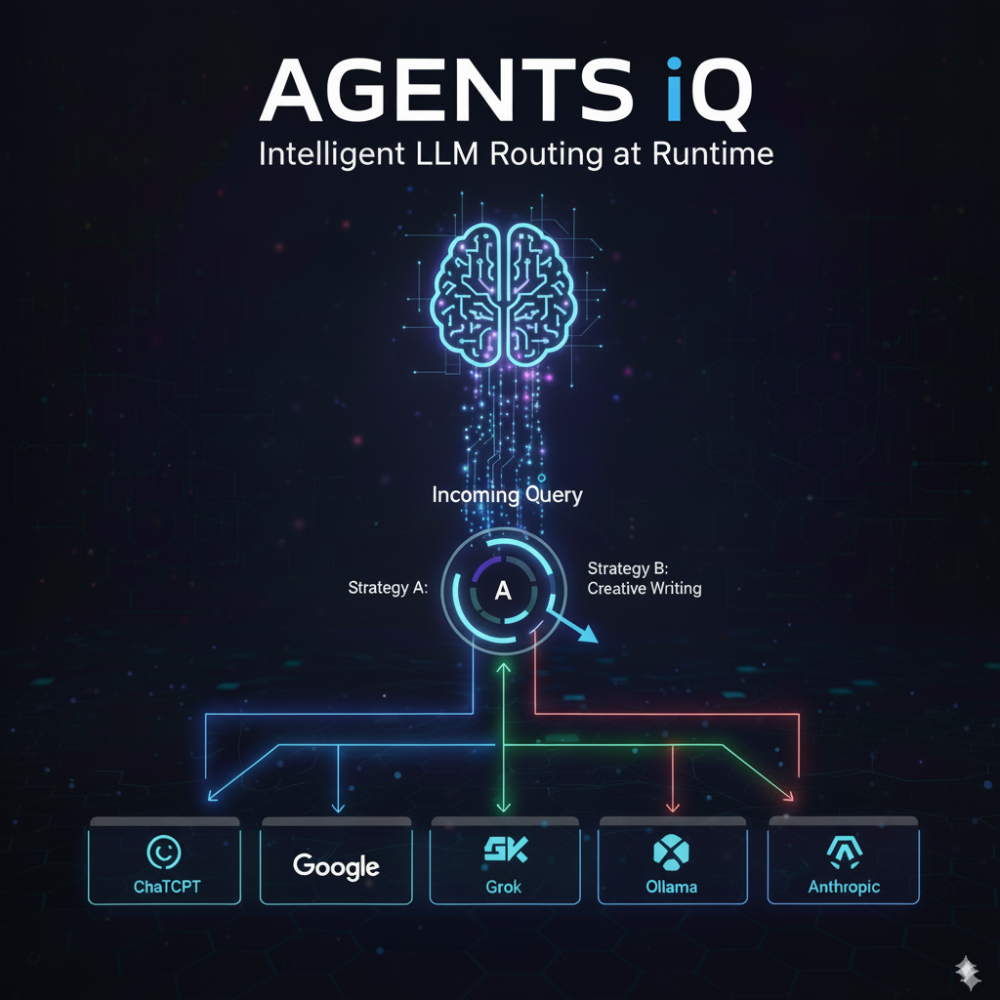
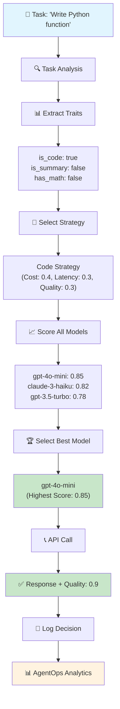
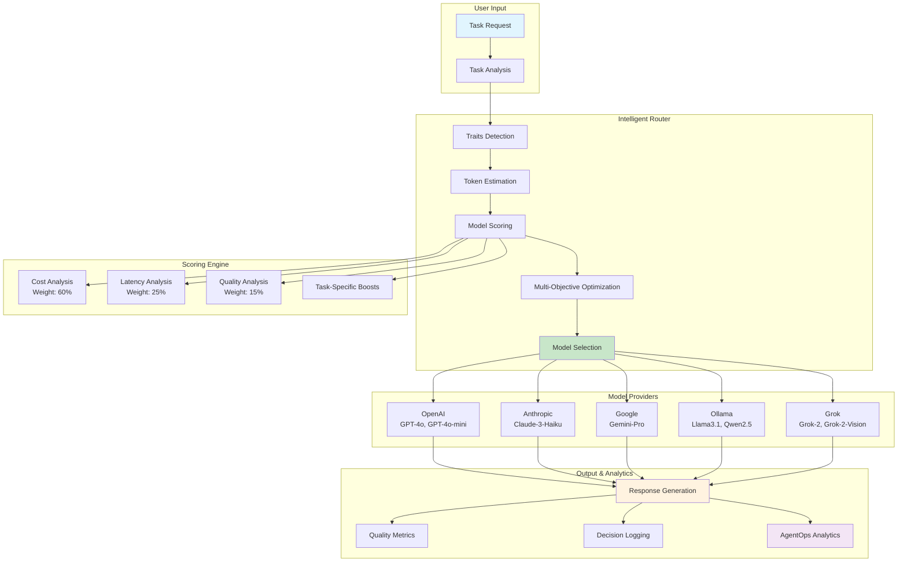

# AgentsIQ — Intelligent Multi-Model Router 🚀

<div align="center">



**The Ultimate LLM Selection Engine** — AgentsIQ automatically chooses the most cost-efficient, fastest, and highest-quality model for each task, supporting **10+ models** including OpenAI, Anthropic, Google, **Ollama (local)**, and **Grok**. Features comprehensive benchmarking with beautiful visualizations and real-time performance analytics.

## 🎥 Watch AgentsIQ in Action

<div align="center">

https://github.com/yourusername/AgentsIQ/assets/youruserid/AgentIQ.mp4

*See AgentsIQ intelligently route between models in real-time*

</div>

[](https://agentops.ai)
[](https://python.org)
[](LICENSE)

</div>

## 🌟 What Makes AgentsIQ Intelligent

- **🧠 Intelligent Selection**: Automatically picks the best model based on cost, latency, and quality
- **📊 Comprehensive Benchmarking**: Beautiful graphs showing model performance across different tasks
- **💰 Cost Optimization**: Save up to 90% on API costs while maintaining quality
- **🏠 Local Models**: Full Ollama support for privacy and zero-cost inference
- **⚡ Real-time Analytics**: Live dashboard with performance metrics and decision explanations
- **🎯 Task-Aware Routing**: Different models excel at different tasks (coding, summarization, creative writing)
- **🔧 Zero Configuration**: Works out of the box with smart defaults

## Why it’s unique
- **Decision intelligence**: objective function balances **cost, latency, quality** with task-aware tweaks (code/summarize/math).
- **Explainability**: logs a full rationale (normalized scores, est. tokens, est. cost, **savings vs next‑best** & **vs GPT‑4o**).
- **Live control**: adjust strategy/weights on the fly via `/control` without redeploying.
- **Shared router**: `RouterManager` ensures both the runner **and** dashboard operate on the same model router instance in a **single process** (`examples/serve_and_demo.py`).
- **Observability**: dark dashboard with **sparklines**, **p50/p90/p99** bars, raw logs and CSV metrics; AgentOps auto‑init if key present.
- **Config‑first**: override profiles/weights in `config.yaml` — no code edits required.

## 🚀 Quick Start

### Installation

#### Option 1: Basic Installation (Core Features)
```bash
pip install agentsiq
```
*Installs core functionality with minimal dependencies*

#### Option 2: Full Installation (All Features)
```bash
pip install agentsiq[all]
```
*Installs all AI/LLM, web, data, and monitoring features*

#### Option 3: Modular Installation (Choose Your Features)
```bash
# AI/LLM features (OpenAI, Anthropic, Google)
pip install agentsiq[ai]

# Web framework features (FastAPI, Uvicorn)
pip install agentsiq[web]

# Data analysis features (Pandas, Matplotlib, NumPy)
pip install agentsiq[data]

# Monitoring features (AgentOps)
pip install agentsiq[monitoring]

# Development features (Testing, Linting)
pip install agentsiq[dev]

# Documentation features (Sphinx)
pip install agentsiq[docs]
```

#### Option 4: Install from Source
```bash
git clone https://github.com/yourusername/AgentsIQ.git
cd AgentsIQ
python -m venv venv && source venv/bin/activate   # Windows: venv\Scripts\activate
pip install -e .
```

#### Option 5: Development Installation
```bash
git clone https://github.com/yourusername/AgentsIQ.git
cd AgentsIQ
python -m venv venv && source venv/bin/activate
pip install -e ".[dev,docs]"
```

### Environment Setup
Create a `.env` file with your API keys:
```bash
# Required for cloud models
OPENAI_API_KEY=your_openai_key
ANTHROPIC_API_KEY=your_anthropic_key
GOOGLE_API_KEY=your_google_key
GROK_API_KEY=your_grok_key

# Optional: Ollama configuration (defaults to localhost:11434)
OLLAMA_URL=http://localhost:11434

# Optional: AgentOps for advanced analytics
AGENTOPS_API_KEY=your_agentops_key
```

### 📦 Modular Dependencies

AgentsIQ uses a modular dependency structure to ensure compatibility and flexibility:

**Core Dependencies (Always Installed):**
- `pyyaml` - Configuration file handling
- `python-dotenv` - Environment variable management
- `requests` - HTTP requests for API calls

**Optional Dependencies (Install as needed):**
- `agentsiq[ai]` - AI/LLM providers (OpenAI, Anthropic, Google)
- `agentsiq[web]` - Web framework (FastAPI, Uvicorn)
- `agentsiq[data]` - Data analysis (Pandas, Matplotlib, NumPy, Seaborn)
- `agentsiq[monitoring]` - Performance monitoring (AgentOps)
- `agentsiq[dev]` - Development tools (Testing, Linting)
- `agentsiq[docs]` - Documentation tools (Sphinx)

**Benefits:**
- ✅ **Test PyPI Compatible**: Core package installs without dependency conflicts
- ✅ **Lightweight**: Install only what you need
- ✅ **Flexible**: Easy to add new features
- ✅ **Production Ready**: Full features available on main PyPI

### Installation Requirements by Use Case

| Use Case | Installation Command | What You Get |
|----------|---------------------|--------------|
| **Basic Routing** | `pip install agentsiq` | Core model selection, basic API calls |
| **AI Development** | `pip install agentsiq[ai]` | + OpenAI, Anthropic, Google integration |
| **Web Applications** | `pip install agentsiq[web]` | + FastAPI, Uvicorn for web services |
| **Data Analysis** | `pip install agentsiq[data]` | + Pandas, Matplotlib, NumPy, Seaborn |
| **Production Monitoring** | `pip install agentsiq[monitoring]` | + AgentOps integration |
| **Full Stack** | `pip install agentsiq[all]` | All features for complete applications |
| **Development** | `pip install agentsiq[dev]` | + Testing, linting, code quality tools |

### Run the Enhanced Benchmark
```bash
python examples/benchmark.py
```
Choose option 1 for the comprehensive model comparison with beautiful visualizations!

### 📓 Jupyter Notebook Examples
```bash
# Start Jupyter Lab
jupyter lab examples/notebooks/

# Or start Jupyter Notebook
jupyter notebook examples/notebooks/
```

**Available Notebooks:**
- **🔍 Basic Search Agent** - Learn fundamentals with simple search agents
- **🚀 Advanced Search Agent** - Multi-agent collaboration and web search
- **🔬 Research Agent** - Deep research and analysis capabilities
- **🎯 Complete Agent System** - Enterprise-grade multi-agent systems

See [Notebook Examples](examples/notebooks/README.md) for detailed learning paths and tutorials.

## 📊 Supported Models

<div align="center">

| Provider | Models | Cost/1K tokens | Best For | Logo |
|----------|--------|---------------|----------|------|
|  | GPT-4o, GPT-4o-mini | $5.00, $0.15 | Code generation, complex reasoning | 🤖 |
|  | Claude-3-Haiku | $0.25 | Summarization, analysis | 🧠 |
|  | Gemini-Pro | $0.125 | General purpose, fast responses | 🔍 |
|  | Llama3.1 (8B/70B), Qwen2.5 (7B/72B) | $0.00 | Local inference, privacy | 🏠 |
|  | Grok-2, Grok-2-Vision | $0.20-0.25 | Creative writing, humor | 😄 |

</div>

## 🎯 Usage Examples

### Basic Usage (Core Features)
```python
from agentsiq.router import ModelRouter

router = ModelRouter()
model = router.select_model("Write a Python function to sort a list")
response, quality = router.call_model(model, "Write a Python function to sort a list")
print(f"Selected: {model}, Quality: {quality}")
```

### Advanced Usage (With AI Features)
```python
# Install with: pip install agentsiq[ai]
from agentsiq.router import ModelRouter
from agentsiq.agent import Agent
from agentsiq.collab import Collab

# Create specialized agents
researcher = Agent("Researcher", "Conducts research and analysis")
analyst = Agent("Analyst", "Analyzes data and provides insights")

# Create collaboration system
collab = Collab([researcher, analyst])

# Run collaborative task
result = collab.run("Research the latest trends in AI and provide analysis")
print(result["aggregated"])
```

> 📖 **Want to understand how the intelligent selection works?** 
> 
> Check out our [Architecture Documentation](docs/architecture.md) for a detailed explanation of the multi-objective optimization algorithm and decision-making process.

### Multi-Agent Collaboration
```python
from agentsiq.agent import Agent
from agentsiq.collab import Collab
from agentsiq.router import ModelRouter

researcher = Agent("Researcher", "Finds information", "openai:gpt-4o-mini", ["retrieval"])
analyst = Agent("Analyst", "Summarizes info", "anthropic:claude-3-haiku", ["summarize"])
router = ModelRouter()
collab = Collab([researcher, analyst], {"retrieval": lambda _: "[retrieval] ok", "summarize": lambda _: "[summary] ok"})

result = collab.run("Analyze the latest trends in AI")
```

## 🖥️ Dashboard & Analytics

### Run the Dashboard
```bash
python -m examples.serve_and_demo
# open http://127.0.0.1:8000  → Summary, Decisions, Control, Health
```

### Features
- **Real-time Performance Metrics**: Live charts showing model selection patterns
- **Cost Analysis**: Track savings vs baseline models
- **Decision Explanations**: See exactly why each model was chosen
- **Control Panel**: Adjust routing strategy and weights on the fly

## 📈 Advanced Benchmarking

The enhanced benchmark system provides comprehensive analysis across multiple dimensions:

### Benchmark Features
- **Multi-Task Testing**: Tests models across coding, summarization, creative writing, technical analysis, and problem-solving
- **Performance Visualizations**: Beautiful charts showing response times, costs, and quality scores
- **Trade-off Analysis**: Scatter plots revealing cost vs quality and speed vs quality relationships
- **Task-Specific Insights**: Heatmaps showing which models excel at specific task categories
- **Detailed Reporting**: JSON exports with complete performance data

### Sample Benchmark Output
```
🏆 MODEL PERFORMANCE SUMMARY
------------------------------
Model                    Avg Response Time (s)  Avg Cost ($)  Avg Quality Score  Tasks Completed
ollama:qwen2.5:7b        0.2500                 0.0000       0.8000             5
ollama:llama3.1:8b       0.3000                 0.0000       0.8200             5
google:gemini-pro        0.6000                 0.1250       0.7800             5
anthropic:claude-3-haiku 0.7000                 0.2500       0.8000             5
openai:gpt-4o-mini       0.8000                 0.1500       0.7500             5
grok:grok-2              0.9000                 0.2000       0.9000             5
openai:gpt-4o            1.0000                 5.0000       0.9500             5
```

### Generated Visualizations

<div align="center">


*Comprehensive 9-chart analysis showing model performance across all dimensions*

</div>

**Chart Breakdown:**
- **Response Time Comparison**: Bar chart showing average response times
- **Cost Analysis**: Cost per request across all models  
- **Quality Scores**: Performance comparison with quality metrics
- **Model Usage Count**: Which models were selected during benchmark
- **Trade-off Scatter Plots**: Cost vs Quality and Speed vs Quality analysis
- **Model Configuration Summary**: Complete specs table for all models
- **Task Category Heatmap**: Performance matrix across different task types
- **Cost Savings Analysis**: Savings vs GPT-4o baseline

## 🔄 Decision Flow Diagram



## 🏠 Local Model Setup (Ollama)

### Install Ollama
```bash
# macOS/Linux
curl -fsSL https://ollama.ai/install.sh | sh

# Windows
# Download from https://ollama.ai/download
```

### Pull Models
```bash
# Fast models (recommended for testing)
ollama pull llama3.1:8b
ollama pull qwen2.5:7b

# High-quality models (requires more RAM)
ollama pull llama3.1:70b
ollama pull qwen2.5:72b
```

### Verify Installation
```bash
ollama list
# Should show your downloaded models
```

### Automated Setup (Recommended)
```bash
python setup_ollama.py
```
This script will:
- Install Ollama if not present
- Download recommended models (llama3.1:8b, qwen2.5:7b)
- Test the connection
- Create .env.example with proper configuration

## 🏗️ Architecture Overview

<div align="center">



*AgentsIQ's intelligent multi-objective optimization system*

</div>

**📖 Detailed Architecture**: See [Architecture Documentation](docs/architecture.md) for complete technical details.

## 🔍 AgentOps Integration

<div align="center">


</div>

AgentsIQ seamlessly integrates with **AgentOps** for advanced analytics and observability:

- **📈 Real-time Metrics**: Track model performance, costs, and decision patterns
- **🎯 Decision Tracing**: See exactly why each model was chosen
- **📊 Performance Analytics**: Detailed insights into routing efficiency
- **💰 Cost Optimization**: Monitor savings and identify optimization opportunities
- **🔍 Debugging**: Comprehensive logs for troubleshooting and optimization

### Setup AgentOps
```bash
# Add to your .env file
AGENTOPS_API_KEY=your_agentops_key_here
```

## 🎯 Why AgentsIQ ?

1. **💰 Massive Cost Savings**: Automatically route to cheaper models without sacrificing quality
2. **🏠 Privacy-First**: Full local model support with Ollama integration
3. **📊 Data-Driven**: Comprehensive benchmarking with beautiful visualizations
4. **⚡ Performance**: Smart routing reduces latency by choosing optimal models
5. **🔧 Developer-Friendly**: Simple API, extensive documentation, and zero configuration
6. **🎨 Beautiful UI**: Dark dashboard with real-time analytics and control panels
7. **🚀 Future-Proof**: Easy to add new models and providers
8. **📈 Enterprise-Ready**: AgentOps integration for production monitoring

## Control Panel (the “tray” UI in your browser)
- **Route strategy**: `smart | cheapest | fastest | hybrid`
- **Weights** sliders: Cost / Latency / Quality
- Changes take effect immediately in this process.

## Key files
- `agentsiq/router.py` — SMART routing + cost/latency/quality scoring
- `agentsiq/router_manager.py` — **singleton** router (shared in‑process)
- `agentsiq/dashboard.py` — **dark** HTML UI, `/control`, `/summary`, `/decisions`
- `agentsiq/agentops_metrics.py` — metrics CSV + percentiles
- `agentsiq/decision_store.py` — decision rationale JSON
- `examples/serve_and_demo.py` — **single‑process** server + demo runner

## Sample HTML chart (from real metrics)
Open **`docs/metrics_demo.html`** locally in your browser — it renders this data with inline SVG sparklines and a dark table:

```json
{
  "Researcher": {
    "calls": 7,
    "avg_latency": 7.43354994910104,
    "avg_confidence": 0.781428571428572,
    "models": {"openai:gpt-4o-mini": 3, "google:gemini-pro": 4},
    "series": [14.05, 21.05, 10.26, 1.74, 2.06, 1.18, 1.69],
    "p50": 2.0557, "p90": 16.8537, "p99": 20.6342
  },
  "Analyst": {
    "calls": 7,
    "avg_latency": 0.2281,
    "avg_confidence": 0.78,
    "models": {"tool:summarize": 2, "anthropic:claude-3-haiku": 1, "google:gemini-pro": 4},
    "series": [0, 0, 1.2955, 0.0757, 0.0778, 0.0690, 0.0789],
    "p50": 0.0757, "p90": 0.5655, "p99": 1.2225
  }
}
```

## Windows console note
If you see `UnicodeEncodeError` from AgentOps (emoji in logs), this project applies a **SafeConsoleFilter** automatically when `AGENTOPS_API_KEY` is set. You can also set `PYTHONUTF8=1` or `PYTHONIOENCODING=utf-8` to allow emojis.

## 🤝 Contributing

We welcome contributions! Please see our [Contributing Guide](CONTRIBUTING.md) for details.

## 📄 License

This project is licensed under the MIT License - see the [LICENSE](LICENSE) file for details.

---

<div align="center">

**Made with ❤️ by the AgentsIQ Team**

[](https://github.com/yourusername/AgentsIQ)
[](https://discord.gg/agentsiq)
[](https://twitter.com/agentsiq)

**⭐ Star this repo if you find it helpful!**

</div>
